## Java黑马程序员学习笔记

Java语言跨平台原理

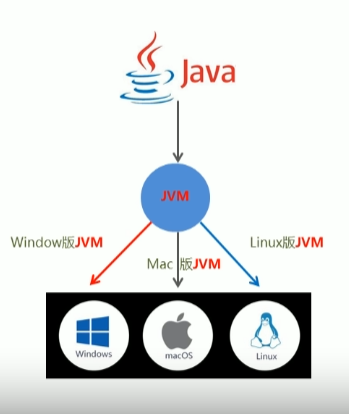

### JRE和JDK

#### 	JRE

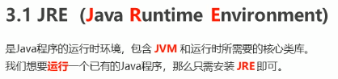

#### 	JDK

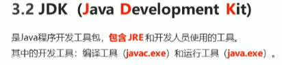

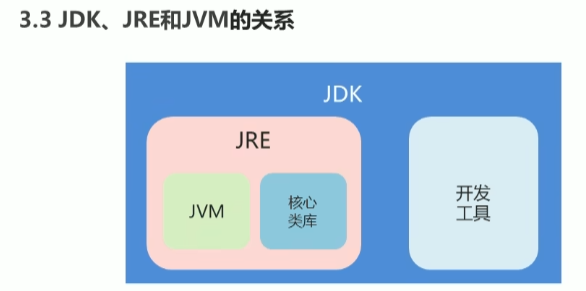

### HelloWorld案例

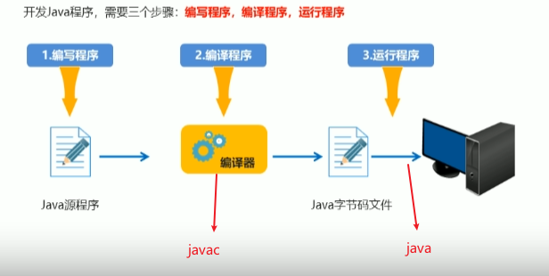

```java
public class HelloWorld {    //Helloworld类
    /* 第一个Java程序
     * 它将输出字符串 Hello World
     */
    public static void main(String[] args) {
        System.out.println("Hello World"); // 输出 Hello World
    }
}
```

### 模块操作

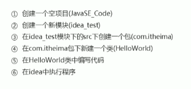

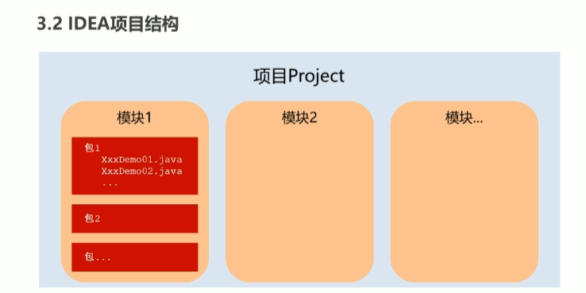

### 方法

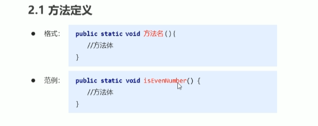

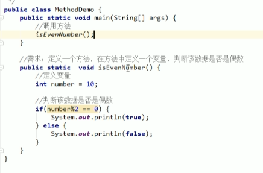

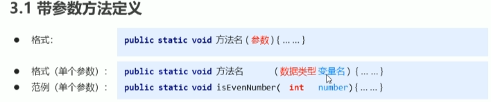


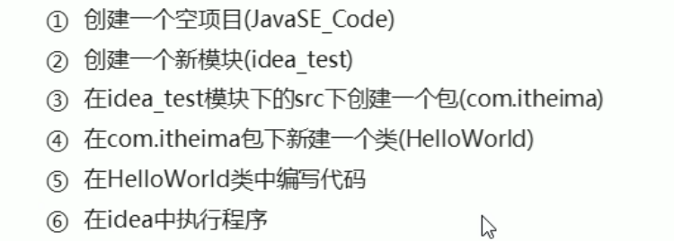


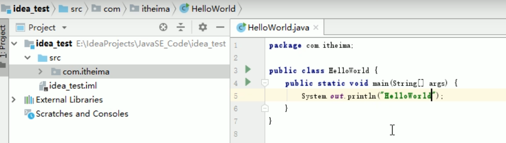


**要实现一个接口 要重写里面所有的方法**


