## github学习笔记

**Repository  仓库**

仓库用来存放项目代码，每个项目对于一个仓库，多个开源项目测有多个仓库

**star 收藏**

收藏项目，方便下次查看

**fork   复制克隆项目**

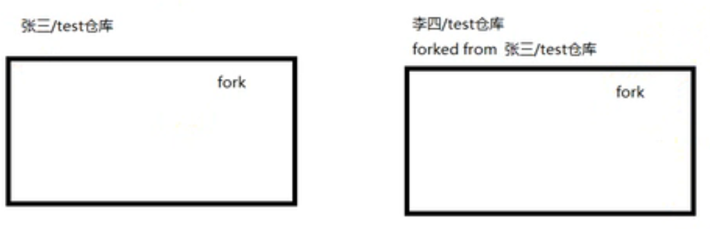

tips：该fork的项目是独立存在的

**Pull Request 	发起请求**

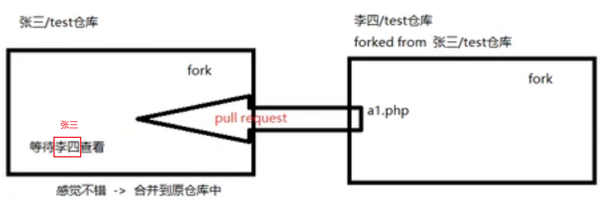

**Watch	关注**

项目更新就会第一时间收到通知提醒

**Issue	事务卡片**

发现代码bug，就可以给提问题

### 创建仓库

​						 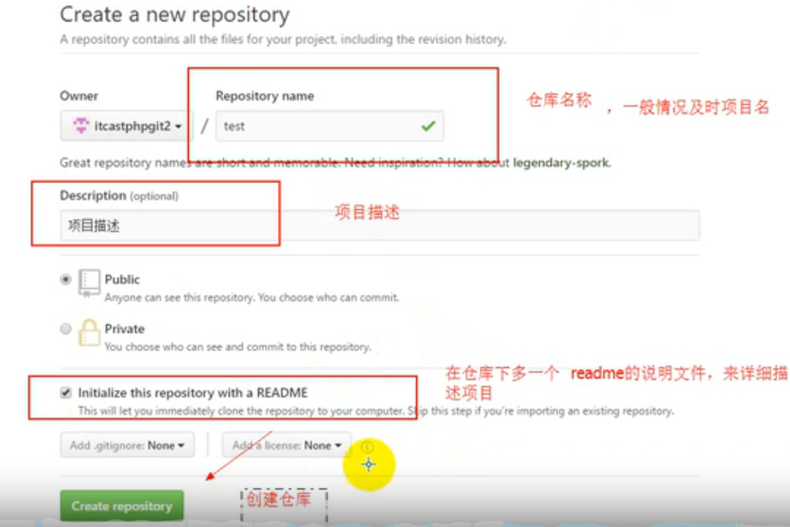

### 仓库主页

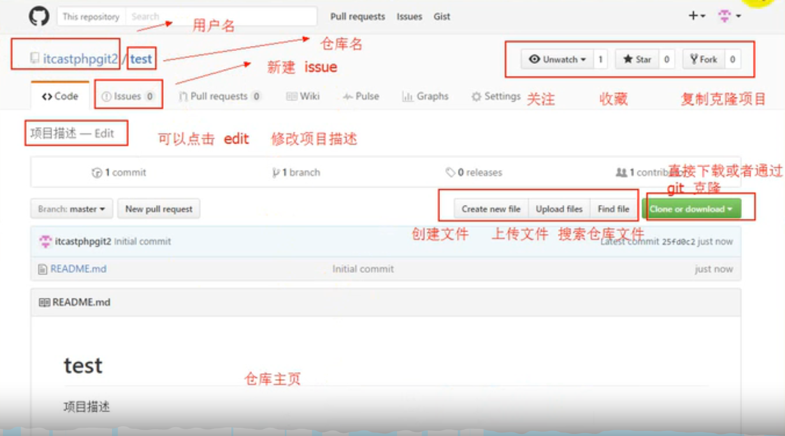

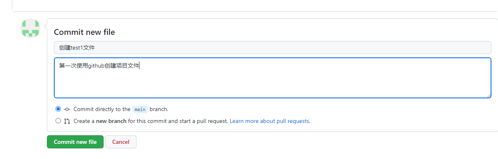

### Github Issues

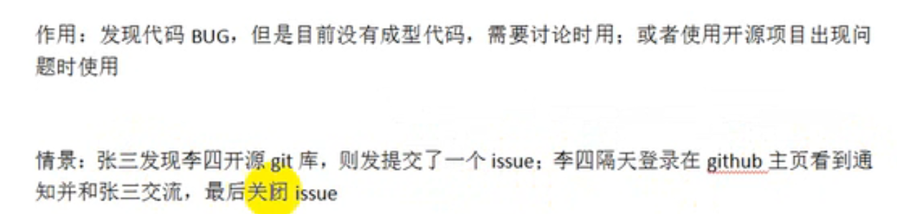

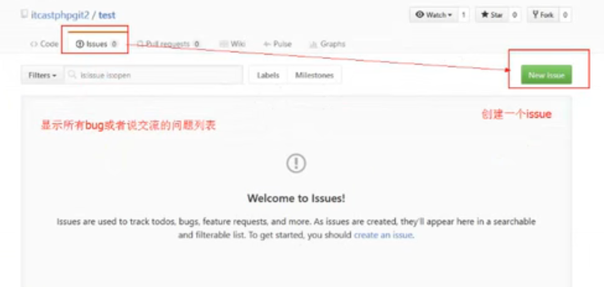

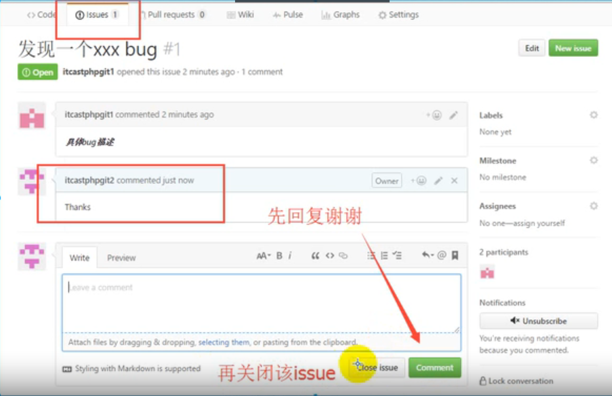

### Git基本工作流程

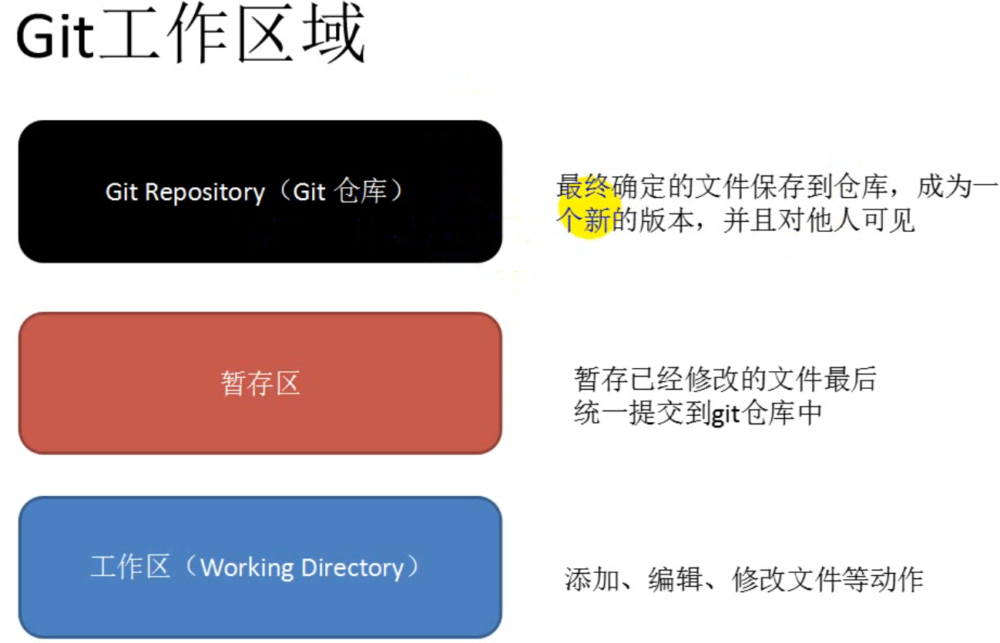

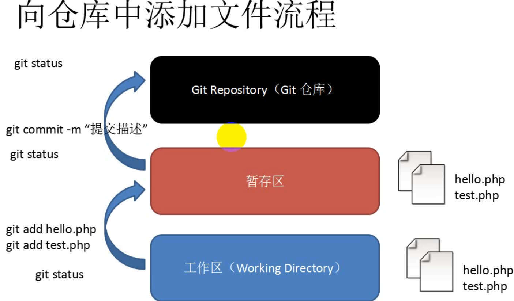

### 对本地仓库操作

#### Git初始化

**设置用户名** 		git config --global user.name 'username'

**设置用户名邮箱	**	git config --global user.email 'email'

初始化仓库 git init

查看提交状态   git status

提交到暂存区 git add

将文件从暂存区提交到仓库 git commit -m '提交描述'

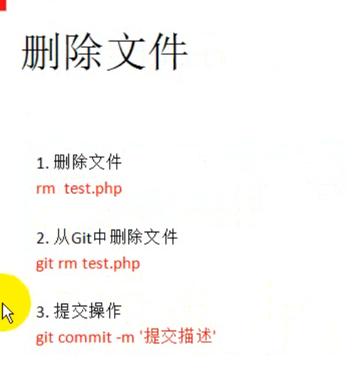

### 对远程仓库操作

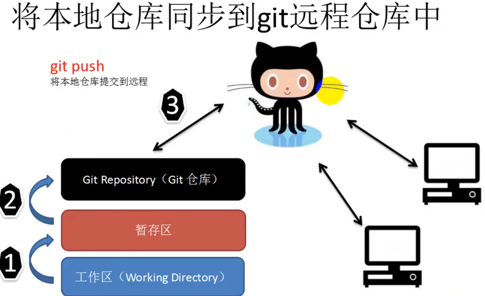

**克隆**		git clone  仓库地址	

**推送** 		git push 

**git常用指令：**https://blog.csdn.net/c_playboy/article/details/71425531

### 5个隐藏的Github技巧

1、github搜索技巧：https://blog.csdn.net/wangxueying5172/article/details/120260848

2、按t 对仓库内所有文件进行搜索   按L 快速跳转到某一行  按b查看该文件的改动记录

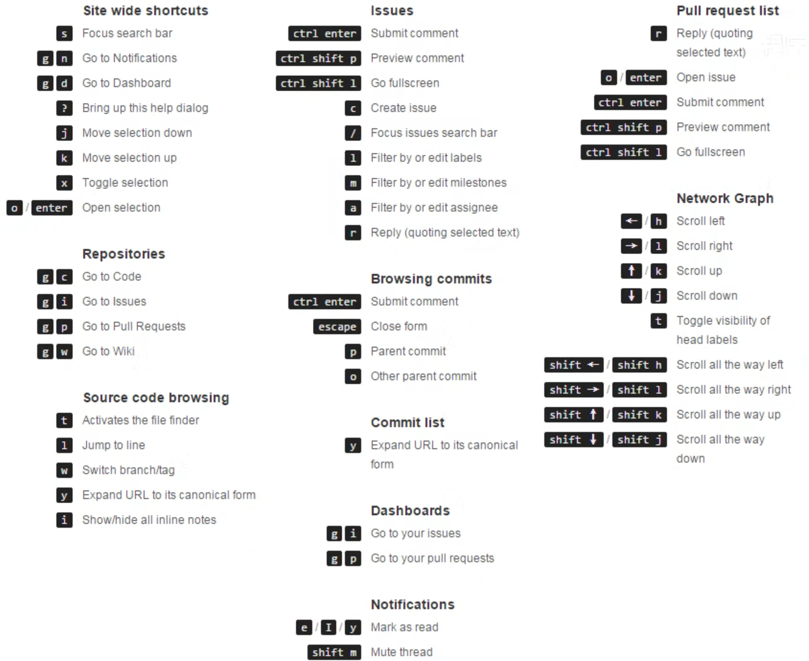

3、在仓库界面按下  ‘。’ 在网页版的vscode上打开了

4、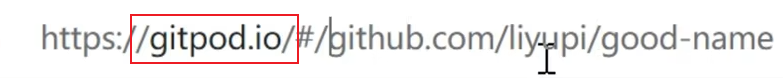

5、explore中可以设置定期给邮箱推送优质项目

git log

git reset --hard e9ed30024eb733c598df7814e424491445997088

git push -f origin Branch_jzw

git pull origin master

git push -f origin Branch_jzw
