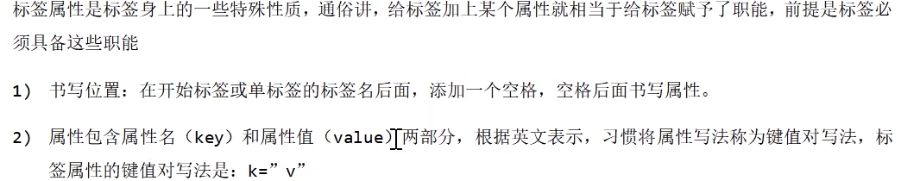
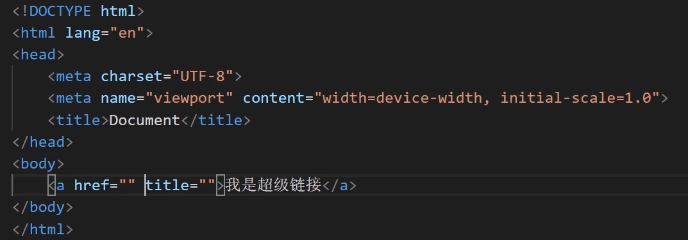
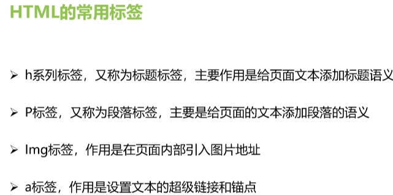
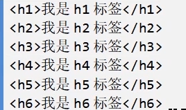
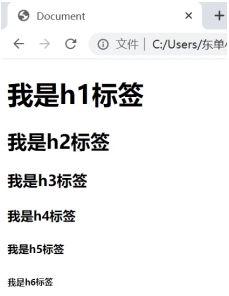
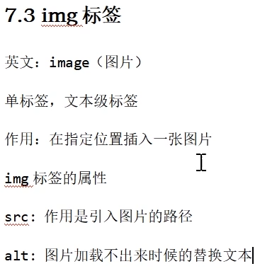
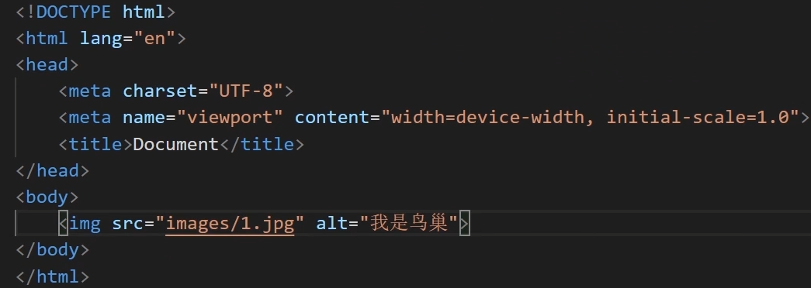

## 学习笔记

常用必备vscode插件：Elm Emmet、HTML CSS Support、HTML Snippets、Sublime Text Keymap and Settings Importer、


### html、css和js之间的关系 

html	定义网页的结构	——>人的骨骼与器官

css		描述网页的样子	——>人的皮肤

js											——>人的大脑

html+css							——>植物人

html+css+js  					——>人

### 输出

JavaScript 可以通过不同的方式来输出数据：

- 使用 **window.alert()** 弹出警告框。
- 使用 **document.write()** 方法将内容写到 HTML 文档中。
- 使用 **innerHTML** 写入到 HTML 元素。
- 使用 **console.log()** 写入到浏览器的控制台

### 变量

#### 变量的使用

##### 声明变量

```javascript
var age； //声明一个变量
```

##### 赋值

```javascript
age = 18;
```

##### 输出结果

```javascript
console.log(age)
```

### 标签

| 单标签 | 双标签 |
| ------ | ------ |
| img    | h1-h6  |
| br     | div    |
| hr     | span   |
|        | p      |
|        | a      |
|        | ul+li  |

**根据标签的种类区分两个等级，分别是容器级和文本级**

容器级：元素内部除了可以存放文本之外，还可以嵌套标签

文本级：元素内部只能存放文本或者文本级标签

| 容器级标签                 | 文本级标签     |
| -------------------------- | -------------- |
| div,ol,ul,li,dl,dt,ddh1-h6 | span,img,b,u,i |






```html
&nbsp;	表示空格
```












